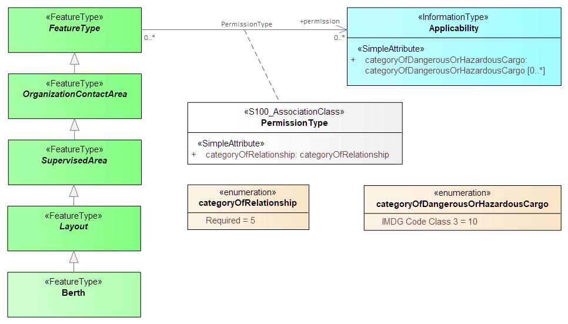
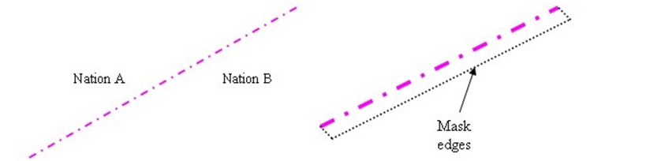

[data2text,PROD=config/product.json]
----
[[sec_2]]
== General
[[sec_2.1]]
===	Introduction
This Data Classification and Encoding Guide (DCEG) contains rules and guidance for converting data describing the real world into data products that conform to the {{PROD.id}} specification.

The {{PROD.id}} specification contains an application schema (UML model) describing the conceptual domain model in terms of classes and relationships, and a Feature Catalogue (see {{PROD.id}} Annex C) that specifies the data model, i.e., specifies the data model types and associations corresponding to the various classes and relationships in the application schema.

To simplify the DCEG text, the various data model types will be provided without the suffixes “class”, “type” or “instance”; e.g. the term “feature” should be understood as “feature class” or “feature type” or “feature instance” as best fits the immediate context in which it is used (and where there might be confusion, it is written out in full as feature class/type/instance).The model defines real world entities as a combination of descriptive and spatial characteristics ({{PROD.id}} Product Specification clause 6).

This clause of the DCEG contains general information needed to understand the encoding rules and describes fundamental common rules and constraints. It also describes datasets and metadata. The data model object types used within {{PROD.id}} and their encoding rules and guidelines are defined in detail in subsequent clauses of this document.

Within this document the features, information types, associations, and attributes appear in *bold text* or _italic text_,
to distinguish them from surrounding words.

[[sec_2.2]]
===	Descriptive characteristics

[[sec_2.2.1]]
====	Feature

A feature contains descriptive attributes that characterize real world entities.
 
The word ‘feature’ as used in the ISO 191xx series and in S-100 based product specifications has two distinct but related senses – ‘feature type’ and ‘feature instance’.  A feature instance is a single occurrence of the feature and is represented as an object in a dataset.
The location of a feature instance on the Earth’s surface is indicated by a relationship to one or more spatial primitive instances.  A feature instance may exist without referencing a spatial primitive instance.

[[sec_2.2.1.1]]
=====	Geographic feature class

Geographic (Geo) feature types carry the descriptive characteristics of a real world entity which is provided by a spatial primitive instance.

[[sec_2.2.1.2]]
=====	Meta feature class

A meta feature type contains information about other features.

[[sec_2.2.1.3]]
=====	Charted background feature

The data product would mostly be visualized as an overlay of an ENC or other GIS applications. Consequently, all necessary descriptive and spatial characteristics to provide a charted background should be provided by the underlying application.

[[sec_2.2.2]]
=====	Information type

An information type has no geometry and therefore is not associated to any spatial primitives to indicate its location. 

An information type may have attributes and can be associated with features or other information types in order to carry information particular to these associated features or information types.

[[sec_2.3]]
===	Spatial characteristics

[[sec_2.3.1]]
====	Spatial primitives

The allowable spatial primitive for each feature is defined in the Feature Catalogue.  Allowable spatial primitives are point, curve, and surface. 

Within this document, allowable spatial primitives are included in the description of each feature.
For easy reference, <<table_general_primitives>> below summarises the allowable spatial primitives for each feature.  In the table, abbreviations are as follows: point (P), curve \(C), surface (S), and none (N). Abstract features are excluded from this table since they cannot have feature instances in datasets. 

include::miscellaneous/table-general-primitives.adoc[]

[[sec_2.3.2]]
====	Capture density guideline

Coordinate density can have a significant impact on file size and system performance. A rule of thumb is to limit the coordinate density to 0.3 mm at maximum permitted display scale. For a scaleless product, the producer should keep in mind the expected scale range for typical use and the density of coordinates needed to suit the needs of the product.

The capture density will follow the recommendation of the S-101 (ENC) DCEG, which states curves and surface boundaries should not be encoded at a point density greater than 0.3 mm at permitted display scale.

A curve consists of one or more curve segments.  Each curve segment is defined as a loxodromic line on WGS84, or as an arc or circle.  Long lines may need to have additional coordinates inserted to cater for the effects of projection change.

The presentation of line styles may be affected by curve length.  Therefore, the encoder must be aware that splitting a curve into numerous small curves may result in poor symbolization.

[[sec_2.4]]
===	Attributes

Attributes may be simple type or complex type.  Complex \(C) attributes are aggregates of other attributes that can be simple type or complex type attributes.  Simple (S) attributes are assigned to one of the types collected in clause <<sec_2.4.1,droploc%>>.

The binding of attributes to a feature, the binding of attributes to attributes to construct complex attributes, and attribute multiplicity are all defined in the Feature Catalogue.

Within this document, the allowable attributes are included in the description of each feature, as well as the allowable values for enumeration type attributes.

[[sec_2.4.1]]
====	Simple attribute types

Each simple attribute is assigned one of the attribute datatypes in <<table_types>>:

[[table_types]]
[cols="a,2a,7a",options="headers,unbreakable"]
.Simple attribute types
|===
h|Abbreviation	h|Attribute type	h|Description

|BO | Boolean | A value representing binary logic.  The value can be either _true_ or _false_.  The default state for Boolean type attributes (i.e. where the attribute is not populated for the feature) is _false_. +
NB: The XML schema specification states that a boolean data type can have the following legal literals: true, false, 1, 0.
|CL | Code List | A type of flexible enumeration (see “EN” below).  A code list type is a list of literals which may be extended only in conformance with specified rules. Attributes of a code list type may take values from the list or other values which are defined according to the rules. The rules should be part of the specification of the individual codelist type.  A code list could either be closed (fixed) or open (extensible).
--
A code list type has the following properties: +
1. A description of the code list type, +
2. The URI where the list could be found, and + 
3. An encoding instruction.
--
|DA | Date | A date provides values for year, month and day according to the Gregorian Calendar. +
Example (XML/GML):  1998-09-18 (YYYY-MM-DD) +
{{PROD.id}} uses only XML-based formats (including GML) and therefore the ISO “basic” format described in S-100 is not used.
|DT | Date and Time | A DateTime is a combination of a date and a time type. +
Example (XML/GML):  1985-04-12T10:15:30 (YYYY-MM-DDThh:mm:ss) +
{{PROD.id}} uses only XML-based formats (including GML) and therefore the ISO “basic” format described in S-100 is not used.
|EN | Enumeration | A fixed list of valid identifiers of named literal values.  Attributes of an enumerated type may only take values from this list.
|IN | Integer | A signed integer number.  The representation of an integer is encapsulation and usage dependent. +
Integer attribute values must not be padded by non-significant zeroes.  For example, for a number of 19, the value populated for the attribute must be 19 and not 019. +
Examples:  29, -65547
|RE | Real | A signed real (floating point) number consisting of a mantissa and an exponent.  The representation of a real is encapsulation and usage dependent. +
Real attribute values must not be padded by non-significant zeroes.  For example, for a signal period of 2.5 seconds, the value populated for the attribute signal period must be 2.5 and not 02.50. +
Examples:  23.501, -0.0001234, -23.0, 3.141296
|TD | Truncated Date | One or more significant components of the modelling date are omitted. +
Example: A GML dataset would use a GML built-in type and encode it as +
`<gMonth>--02<gMonth>` +
{{PROD.id}} uses only XML-based formats (including GML) and therefore the ISO “basic” format described in S-100 is not used.
|TE | Free text | An arbitrary-length sequence of characters including accents and special characters from a repertoire of one of the adopted character sets.
|TI | Time | A time is given by an hour, minute, and second.  Time zone according to UTC is optional.  Character encoding of a time is a string that follows the local time. +
Examples (XML/GML):  18:30:59Z; 18:30:59+01:00; 18:30:59
|URL | URL | A uniform resource locator (URL) is a URI that provides a means of locating the resource by describing its primary access mechanism (RFC 3986). +
Example: \https://registry.iho.int
|URN | URN | A persistent, location-independent, resource identifier that follows the syntax and semantics for URNs specified in RFC 2141. +
Example: urn:mrn:iho:{{PROD.id}}:1:0:0:Regulations
|===

[[sec_2.4.2]]
====	Mandatory attributes

Some attributes are mandatory and must be populated for a given feature.  There are some reasons why attribute values may be considered mandatory:

* They are fundamental to the definition of a feature;
* They are required to support the correct portrayal of a feature instance;
* Certain features make no logical sense without specific attributes;
* Some attributes are required for safety of navigation.

Within this document, mandatory attributes are those with a multiplicity of 1,1 or 1,n (n>1) or 1,*.  The attribute multiplicity is identified in the description of each feature class.

[[sec_2.4.3]]
====	Conditional attributes

The feature classes or information types do not contain conditional attributes.

Complex attributes which are assigned to feature classes or information types have at least one sub-attribute which is mandatory (or conditionally mandatory). Where the sub-attribute of a complex attribute is conditional, this is indicated in the Remarks sub-clause for the relevant feature class entries.

[[sec_2.4.4]]
====	Missing attribute values

Where a value of a mandatory attribute is not known, the attribute must be populated with an empty (null) value, except in the bindings listed in
<<table_unnillable_attributes>> below. Nilling the attributes in <<table_unnillable_attributes>> must be treated as an error in the dataset.

include::miscellaneous/table-unnillable-attributes.adoc[opts=optional]

Where the value of a non-mandatory attribute is not known, the attribute must not be included in the dataset.

If an attribute is nilled, the XML attribute _nilReason_ must be present and populated with one of the "standard" values permitted by the S-100 GML profile. The "other:" value must not be used.
Data Producers may further restrict the permitted values of _nilReason_ for their own products.

If an enumeration or codelist attribute is nilled, the XML attribute _code_ must have the value prescribed by the data format for nilled enumeration/codelist attributes (currently 0). 

[[sec_2.4.5]]
====	Multiplicity

In order to control the number of allowed attribute values or sub-attribute instances within a complex attribute, S-100 uses the concept of multiplicity.  This defines lower and upper limits for the number of values, whether the order of the instances is significant, and if an attribute is mandatory.  Common examples are shown in <<table_multex>>:

Format: MinOccurs, MaxOccurs (a * indicates that infinite instances are possible, the term (ordered) indicates that the order of the provided instances is significant)

[[table_multex]]
[cols="a,4a",options="headers"]
.Multiplicity of attributes
|===
h|Multiplicity	h| Explanation

|0,1|An instance is not required; if provided there must only be one instance.
|1,1|An instance is required and there must only be one instance.
|0,*|An instance is not required and there can be an infinite number of instances.
|1,*|An instance is required and there can be an infinite number of instances.
|1,* (ordered)|An instance is required and there can be an infinite number of instances, the order of which is significant.
|2,2|Two instances are required and there must be no more than two.
|===

An attribute with the same values as another instance of the same attribute bound to the same feature, information type, or complex attribute is an error unless permitted by the relevant encoding instructions
and the duplicate values satisfy the conditions or requirements set forth in the relevant instructions.

[[sec_2.4.6]]
====	Spatial attribute types

Spatial attribute types must contain a referenced geometry and may be associated with spatial quality attributes.  Each spatial attribute instance must be referenced by a feature instance or another spatial attribute instance.

[[sec_2.4.6.1]]
=====	Quality of spatial attributes

The quality of spatial attributes in {{PROD.id}} is described in a *QualityOfNonBathymetricData* meta-feature (clause <<ftable_QualityOfNonBathymetricData,droploc%>>). This meta-feature defines areas within which uniform assessment exists for the quality. It is described in detail later in this document.

If the spatial quality attributes for an individual instance of a spatial primitive differ from the quality indicated in the overlying *QualityOfNonBathymetricData* meta-feature, the quality attributes for that instance are carried in an information class called *SpatialQuality*.  Only points and curves can be associated with *SpatialQuality*.  {{PROD.id}} does not use multi-points. Currently, no use case for associating surfaces with spatial quality attributes is known, therefore this is prohibited.  Vertical uncertainty is prohibited for curves as this dimension is not supported by curves.

NOTE&#58; {{PROD.id}} does not make use of the S-101 Quality of Bathymetric Data meta-feature since depth range uncertainties are not needed. The
*QualityOfNonBathymetricData* meta-feature has all the quality attributes needed by {{PROD.id}}.

The spatial quality of individual spatial primitives can be indicated using the *SpatialQuality* information type (clause <<ftable_SpatialQuality,droploc%>>)
associated to the individual spatial primitive. <<Fig_2.1>> depicts the conceptual model. This should only be used when it is necessary to override the quality
indicated in a covering *QualityOfNonBathymetricData* feature.

A *SpatialQuality* instance should not be created if the quality information to be encoded in it is identical to the quality information in an underlying meta-feature.

[[Fig_2.1]]
.Spatial quality for spatial primitives
image::../images/S-131&#32;Spatial&#32;Quality.png[]

[[sec_2.4.7]]
====	Portrayal feature attributes

{{PROD.name}} data products will be used within ECDIS where ENC data is displayed based on the rules defined within the S-101 Portrayal Catalogue.  While most ECDIS portrayal is based on attributes describing the instance of a particular feature in the real world, certain feature attributes are used in portrayal rules to provide additional functionality in the ECDIS.  <<table_portrayal_attributes>> provides a list of attributes which have specific influence on portrayal.

[[table_portrayal_attributes]]
[cols="a,9a",options="headers"]
.Attributes which have effects on portrayal
|===
h|Attribute h|Effects on portrayal

|fixedDateRange; periodicDateRange| Population of these complex attributes determines when the feature will be added (sub-attribute dateStart) and/or removed (sub-attribute _dateEnd_) from the display in some ECDIS display settings.
|information|Population of this complex attribute will result in the display of the magenta information symbol to highlight additional information to the user.
|nameUsage|This sub-attribute determines the priority and level of display (full display or Pick Report only) where multiple instances of the complex attribute feature name are encoded for a single feature instance, based on Mariner’s selected ECDIS display settings.
|pictorialRepresentation|The population of this Text attribute will result in the display of the magenta information symbol to highlight additional information to the user.
|scaleMinimum|value at which the feature will be removed from the display if application of scale minimum is enabled in the ECDIS.
|textContent|The population of this complex attribute will result in the display of the magenta information symbol to highlight additional information to the user.
|===

[[sec_2.4.8]]
====	Textual information

Textual information may provide additional information essential to understand the presence of the {{PROD.name}} and other features of an {{PROD.id}} product.  This information may also provide legal information pertaining to the {{PROD.id}} product features.

The methods to provide textual information vary from the simple provision of short text, to the more structured provision of extensive text.  The length of the text determines the method and the attribute selection, see clause <<sec_2.4.8.2,droploc%>>.

[[sec_2.4.8.1]]
=====	Specialized information types for common kinds of textual information

The information types *Restrictions*, *Recommendations*, *Regulations*, or *NauticalInformation* must be used to encode text information when the DCEG allows them to be associated to the feature or information type and the information is of the appropriate kind (a restriction, regulation, etc.). 

In exceptional circumstances and only if the use of the information types *Restrictions*, *Recommendations*, or *Regulations* is not sufficient, *NauticalInformation* can be used to encode additional textual information associated to a feature or a group of features.

In some cases, there may be a specialized attribute that is specifically intended for the data in question. If an appropriate specialized attribute is available, it must be used in preference to _information_ or _textContent_. For example, feature names will generally be encoded in the _name_ sub-attribute of complex attribute _featureName_, instead of _information->text_.

[[sec_2.4.8.2]]
=====	Textual information attributes

Textual information which is not appropriate for any of the Text-type attribute (or sub-attribute) allowed for the feature/information type should be encoded using either _information_ or _textContent_ complex attributes. Generally, either _information_ or _textContent_ is allowed, but not both.

[[sec_2.4.8.3]]
=====	Languages

Both _information_ and _textContent_ define a language sub-attribute for specifying the language in which the text is encoded. 

The default exchange language for textual information should be English; therefore it is not required to populate the sub-attribute _language_ for an English version of textual information (unless the _language_ attribute is indicated as mandatory).

Languages other than English may be used as a supplementary option, for which language must be populated with an appropriate value to indicate the language.  

When a national language is used in the textual attributes, the English translation must also exist.

The specification of the language attribute in the IHO GI registry states “The language is encoded by a 3 character code following ISO 639-2/T.” These codes and the corresponding language names may be obtained from the codelist S100_MD_LanguageCode in the S-100 codelists file, which is part of the S-100 schemas distribution, at the URLs below:

* XML file: \https://schemas.s100dev.net/schemas/S100/5.2.0/resources/Codelists/cat/codelists.xml

* Web list: \https://schemas.s100dev.net/schemas/S100/5.2.0/resources/Codelists/cat/codelists.html

[[sec_2.4.8.4]]
=====	Minimal use of generalized text attributes

The complex attributes _information_ and _textContent_ must not be used when it is possible to encode the information by means of any other attribute.  The population of these attributes provides symbols on an ECDIS screen.  Therefore producers should carefully consider use of these attributes as the symbol may contribute significantly to ECDIS screen clutter and text attributes should be populated only when the content conveys useful information.

[[sec_2.4.8.5]]
=====	Short textual information

The _text_ sub-attribute of complex attribute _information_ should generally be used for short notes or to transfer information which cannot be encoded by other attributes, or to give brief information about a feature.  The use of the complex attribute _information_ as a stand-alone complex attribute is intentionally limited to the information types *ContactDetails*, *Applicability*, *NonStandardWorkingDay*, and *ServiceHours*, which do not need the additional attributes defined in _textContent_.  The reason for the limited use of _information_ as a stand-alone complex attribute is to provide a structured and harmonised approach to textual information within the {{PROD.id}} product data sets. 

The text populated in _text_ attributes must not exceed 300 characters. Character strings contained in _text_ attributes must be UTF-8 character encoding.

If the _text_ sub-attribute of _information_ is populated, the _fileReference_ and _fileLocator_ sub-attributes must not be populated.

[[sec_2.4.8.6]]
=====	Complex or lengthy textual information

More complex encodings of text may use either _information_ or _textContent_. The feature catalogue and the feature/information type definitions in this DCEG indicate whether _information_ or _textContent_ is allowed.

The complex attribute _textContent_ also has _information_ as a complex sub-attribute. If a short note must be encoded in a feature or information type which has only _textContent_ as an attribute, it should be encoded as _textContent->information->text_.

Complex text information, such as text longer than 300 characters, formatted text, or HTML extracts from shipping regulations, must be encoded in a file named in either 
information->fileReference or _textContent->information->fileReference_.  The construction _textContent->information->fileReference_ should be used if the feature/information type provides _textContent_ as complex attribute. 

The complex attribute _information_ defines an optional sub-attribute _headline_ which may be used for a short title not exceeding 60 characters. The content should be short but informative – if the textual information is divided into sections, the most relevant section header from the referenced content may be a good choice for _headline_.

Multiple levels of headings are permitted when the upper bound of _headline_ multiplicity is > 1. Multi-level headings must be encoded according to the heading level structure, that is, the highest level heading must be first, then the second level, then the third, and so on.  

The complex attribute _textContent_ defines an optional sub-attribute _categoryOfText_ for indicating whether the text is the full text from the source, an extract from the source, or a summary prepared by the encoder. Populating _categoryOfText_ is recommended whenever the textual information is taken or summarised from a law or regulation.

If it is considered necessary to include a description of the source of the textual information, the sub-attribute _sourceIndication_ of _textContent_ must be used. Encoding a description of the source is strongly recommended for textual information whose source is considered as information the end-user must have, e.g., because the date of issue must be conveyed or because it cites official regulations which are frequently updated.

NOTE&#58; Some government documents are frequently updated, e.g., the U.S. Electronic Code of Federal Regulations, which is currently updated every working day even though a particular section may be stable for years.

[[sec_2.4.9]]
====	Attributes referencing external files

[[sec_2.4.9.1]]
=====	Predefined derived types

<<table_predefined_derived_types>> presents the following predefined derived types which are described in S-100 (clause 1-4.6):

[[table_predefined_derived_types]]
[cols="a,6a,a",options="headers"]
.Predefined derived types
|===
h|Name h|Description h|Derived from

|URI|A uniform resource identifier which character encoding shall follow the syntax rules as defined in RFC 3986. +
EXAMPLE \https://registry.iho.int 	| CharacterString

|URL|A uniform resource locator (URL) is a URI that provides a means of locating the resource by describing its primary access mechanism (RFC 3986). + 
EXAMPLE \https://registry.iho.int 	| URI 

|URN|A persistent, location-independent, resource identifier that follows the syntax and semantics for URNs specified in RFC 2141. +
EXAMPLE urn:iho:s101:1:0:0:AnchorageArea 	| URI 
|===

[[sec_2.4.9.2]]
=====	Reference to textual files

The files referenced by complex attribute _information_ and its sub-attribute _fileReference_ must be .TXT or .HTM files, and may contain formatted text. It is up to the Producing Authority to determine the most suitable means of encoding a particular piece of text (as text or HTML). The format of the reference to the file should be a “file URI” (S-100 1-4.6).

Besides being bound to certain types, the complex attribute _information_ is also a sub-attribute of the complex attribute _textContent_. This means that any type that binds _textContent_ as an attribute can also contain a reference to a textual file via an _information_ sub-attribute. In {{PROD.id}}, there are several features, information types, and complex attributes that bind either _textContent_ or _information_.

The exchange language for textual information should be English. The sub-attribute _language_ must be populated with an appropriate value to indicate the language used. Languages other than English may be used as a supplementary option. Generally this means, when a national language is used in the textual attributes, the English translation must also exist.

Files must only use UTF-8 character encoding even when the sub-attribute _language_ is populated with a language other than English.

If it is necessary to indicate a specific section within a large text file, this may be done by encoding the location in the _fileLocator_ sub-attribute of _information_, as described in <<table_locators>>.

Producers and application developers should note that the use of the fileLocator attribute enables a single support file to contain separate chunks of text referenced from different features, information types, or complex attribute. Adopting this practice enables producers to reduce the number of external files needed with a dataset.

[[table_locators]]
[cols="a,a,6a",options="headers"]
.Locators for external files
|===
h|Format	h|File extension	h|Content of fileLocator

|Text	|TXT	|Locators to text files are not permitted; the file should be split into separate text files or an HTML file used instead.
|HTML	|HTM	|The HTML fragment identifier, i.e., the value of the HTML name or id attribute of the target (as defined in the relevant HTML specification).

|===

[[sec_2.4.9.3]]
=====	Reference to external sources

References to Internet sources should be encoded using the _onlineResource_ sub-attribute of _textContent_. Encoders should be aware that systems may not be able to access the Internet, so _onlineResource_ should be used only for non-essential information.
Only sources that can be certified as secure and free from malicious downloads should be provided.

[[sec_2.4.9.4]]
=====	Reference to graphics

If it is required to indicate a graphic, the complex attribute _graphic_ must be used.  The sub-attribute _pictorialRepresentation_ must be used to indicate the file name (without the path) of the external graphical file.  Graphic files that form part of the data product must be content with the characteristics collected in <<table_graphics_characteristics>>. 

[[table_graphics_characteristics]]
[cols="a,a",options="headers",width="50%",align="left"]
.Graphics characteristics
|===
h|Characteristics	h|Values

|Recommended Resolution| 96 DPI
|Minimum Size x,y| 	200,200 pixels
|Maximum Size x,y| 	800,800 pixels
|Bit Depth| 	8 Bit Indexed Colour
|Compression| 	LZW
|Format| 	Tiff 6.0
|===

File sizes should consider the maximum permitted sizes of datasets and exchange sets.

Additional information about the graphic file may be encoded in other sub-attributes of attribute graphic, as described in clause <<sec_2.4.12,droploc%>>.

[[sec_2.4.10]]
====	 Dates

Dates may be need to be encoded as complete or truncated values, depending on available information and allowed format for the particular attribute. The definition of the attribute will indicate if it must take a complete value (type Date or DA) or is allowed to take a truncated value (type S100_TruncatedDate or TD). Complete and truncated dates are different value types (see S-100 1-4.5.2 Table 1-2).

For attributes that use the complete date type (type Date or DA), all their components (year, month, and day) must be specified.

For attributes that use the truncated date type (type S100_TruncatedDate or TD), zero, one, or two of the year/month/day components may be omitted. If the year component is included, it must be specified using exactly 4 digits.

[[sec_2.4.10.1]]
=====	Complete dates

Dates (except truncated dates, see the following clause) must be encoded in conformance with the Date format as specified in S-100 Clause 1-4.5.2 which is the same as the DA format in <<table_types>> in this document. The data values have to be provided in accordance with the Gregorian Calendar starting with four digits for the year, two digits for the month and two digits for the day.

Example: The date 18 September 2010 is encoded as follows:

In the GML format:		<date>2010-09-18</date>

Note that since both discovery metadata and GML datasets are XML files, both will use the “GML format” above.

[[sec_2.4.10.2]]
=====	Truncated dates

In Truncated Dates one or more components (year, month, or day) of the date is not specified. Truncated date values must be encoded in conformance with the S100_TruncatedDate format or equivalent as specified in S-100 (clauses 1-4.5.2 and 3-9) which is the same as the TD format in <<table_types>> in this document. If encoding attributes which can take truncated date values (e.g., _fixedDateRange_, _periodicDateRange_, _reportedDate_) and no specific year, month, or day is required, the values must be encoded in conformance with the truncated date format as specified in S-100 (clauses 1-4.5.2 and 3-9), using the format-specific type for XML/GML.

To encode partial dates in the XML/GML data format:

[[table_date_encoding]]
[cols="6a,a,3a",options="headers"]
.Date encoding format in XML and GML
|===
| Description	| ISO 8211	| GML

| No specific year, same day each year	|	`––––MMDD`	|	`<gMonthDay>––MM–DD</gMonthDay>`
| No specific year, same month each year	|	`––––MM––`	|	`<gMonth>––MM</gMonth>`
| No specific day	|	`YYYYMM––`	|	`<gYearMonth>YYYY–MM</gYearMonth>`
| No specific month and no specific day	|	`YYYY––––`	|	`<gYear>YYYY</gYear>`
3+| NOTE&#58;	YYYY = calendar year; MM = month; DD = day.
|===

The dashes (`–`) indicating that the year, month, or date which is not specified must be included in the encoding (with no space between the dashes).

[[sec_2.4.10.3]]
=====	Start and end of ranges

In accordance with S-100 clause 3-8, the start and end instants of a range or period are included in the range or period.

EXAMPLE 1: If the beginning of a date range is encoded as the complete date 01 January 2016, the period begins at 00:00:00 on 1 January 2016, and the whole of New Year’s Day is included in the period. If the end of the date range is encoded as 01 January 2016, the period ends at 24:00:00 on 1 January 2016, i.e., again the whole of New Year’s Day is included in the period.

EXAMPLE 2: If the beginning of a period is encoded in truncated date format as `––––01––` (i.e., year and day not specified), the period begins at 00:00:00 on 1 January each year. If the end of the period is encoded as `––––01––`, the period ends at 24:00:00 on 31 January each year.

NOTE (1): Particular care should be taken if the start or end date is 28 or 29 February. S-100 3-8.3 explains the implications for end of February. For example, the truncated date `––––02––` will be interpreted as 29 February in leap years and 28 February in non-leap years, while `––––0228` will be interpreted as 28 February in every year.

NOTE (2): In accordance with ISO practice at the time S-100 date and time formats were defined, the time `00:00:00` means midnight at the start of a day and `24:00:00` means midnight at the end of a day. This continues to be S-100 usage.

Overlapping date, time, or dateTime ranges, whether periodic or fixed, in the same feature, information type, or complex attribute are generally an error.

Null date, time, or dateTime ranges (where the start and end are the same), whether periodic or fixed, in the same feature, information type, or complex attribute are generally an error.

[[sec_2.4.10.4]]
=====	Schedules

Weekly service schedules of a feature can be comprehensively described by using the information types *ServiceHours* and *NonStandardWorkingDay*.

EXAMPLE&#58; A feature service is available under normal operation status 24 hours/day on Monday and Wednesday and from 08:00 to 16:00 LT from Thursday to Saturday.  The service is available by pre-arrangement on public holidays and the 5th of August of each year when they fall on days which would otherwise be normal working days.

----

[source,options="unnumbered"]
----
ServiceHours
	scheduleByDayOfWeek
		categoryOfSchedule =1 (normal operation)
		timeIntervalsByDayofWeek
			dayOfWeek = 2(Monday), 4(Wednesday)
			dayOfWeekIsRange = 0 (false)
		timeIntervalsByDayofWeek
			dayOfWeek = 5(Thursday), 7(Saturday)
			dayOfWeekIsRange = 1 (true)
			timeOfDayStart = 08:00:00
			timeOfDayEnd = 16:00:00
NonStandardWorkingDay
	dateFixed = –––08–05 (5 August)
	dateVariable = public holidays
	information.text = “By pre-arrangement”
----

The above example can be encoded as follows:

[source,options="unnumbered"]
----
    <S131:ServiceHours gml:id="(GML ID of ServiceHours)">
        <scheduleByDayOfWeek>
            <categoryOfSchedule code=”1”>Normal Operation</categoryOfSchedule>
            <timeIntervalsByDayOfWeek>
                <dayOfWeek code=”2”>Monday</dayOfWeek>
                <dayOfWeek code=”4”>Wednesday</dayOfWeek>
                <dayOfWeekIsRange>0</dayOfWeekIsRange>
                <timeOfDayStart>00:00:00</timeOfDayStart>
                <timeOfDayEnd>24:00:00</timeOfDayEnd>
            </timeIntervalsByDayOfWeek>
            <timeIntervalsByDayOfWeek>
                <dayOfWeek code=”5”>Thursday</dayOfWeek>
                <dayOfWeek code=”7”>Saturday</dayOfWeek>
                <dayOfWeekIsRange>1</dayOfWeekIsRange>
                <timeOfDayStart>08:00:00</timeOfDayStart>
                <timeOfDayEnd>16:00:00</timeOfDayEnd>
            </timeIntervalsByDayOfWeek>
        </scheduleByDayOfWeek>
        <partialWorkingDay xlink:href="(reference to NonStandardWorkingDay)"/>
    </S131:ServiceHours>

    <S131:NonStandardWorkingDay gml:id="(GML ID of NonStandardWorkingDay)">
        <dateFixed><gMonthDay>--08-05</gMonthDay></dateFixed>
        <dateVariable>public holidays</dateVariable>
        <information><text>By pre-arrangement</text</information>
        <theServiceHours_nsdy xlink:href="(reference to ServiceHours)"/>
    </S131:NonStandardWorkingDay>
----

If the days of week are known but the hours of availability are unknown, there is no time attribute. Twenty-four availability is indicated by encoding the availability period as 000000-240000. Special cases such as unknown can be explained in the _textContent_ or _information_ attribute of *ServiceHours*.
To encode two or more periods within the same day, repeat the _timeOfDayStart_ and _timeOfDayEnd_ attributes. If one of the times is not known, it may be nilled as described in clause <<sec_2.4.4,droploc%>>.

For example, to encode open hours of 8 a.m. to 12 noon and 1 p.m. to 5 p.m. on Thursdays and Saturdays:

[source,options="unnumbered"]
----
	timeIntervalsByDayofWeek
		dayOfWeek =5(Thursday), 7(Saturday)
		dayOfWeekIsRange =1 (true)
		timeOfDayStart = 08:00:00
		timeOfDayStart = 13:00:00
		timeOfDayEnd = 12:00:00
		timeOfDayEnd = 17:00:00
----

[data2text,PROD=config/product.json]
----
The order of repeated _timeOfDayStart_ and _timeOfDayEnd_ attributes is significant, since intervals are specified by matching them pairwise in order.

UTC is indicated by the Z suffix. The absence of the Z suffix indicates local time.

The absence of any additional information other than date (fixed or variable) in *NonStandardWorkingDay* should be interpreted as closure on the specified days. Non-standard working days do not need to be associated with *ServiceHours* instances categorized as “closure” (_categoryOfSchedule_=Closure) because the closure is already indicated in the *ServiceHours* instance.

[[sec_2.4.10.5]]
=====	Times

If it is required to provide information of the start time and end time of an active period of a feature, it must be encoded using the attributes _timeOfDayStart_ and _timeOfDayEnd_. The order has significance.

[[sec_2.4.11]]
====	Combination of date schedules and times

Schedule information can also include time of day. The complex attribute _timeIntervalsByDayofWeek_ also includes _timeOfDayStart_ and _timeOfDayEnd_ attributes to encode the daily start and end times of service. Complete instructions on how to encode schedules are described in clause <<sec_2.4.10.4,droploc%>>.

[[sec_2.4.12]]
====	Graphic information

A graphic file should be appropriate for the purpose and should supplement the information in terms of navigational relevance.  Preferably, the graphic should provide perspective relevant to the view of the mariner. Graphics should be such that all the information in the graphic is legible in the application display.
Graphic information must be encoded using the complex attribute _graphic_.  The simple sub-attribute _pictureInformation_ should be used to provide credits to the picture creator, copyright owner etc. 
Assuming that graphic information provides a coastal view, mariners are interested in knowing from which point on sea that graphic has been taken.  The complex attribute _bearingInformation_ (see clause <<sec_2.4.12.1,droploc%>>) provides all necessary information. 

[[sec_2.4.12.1]]
=====	Bearing information

The most accurate information should be provided if it is necessary to indicate a position from where a picture has been taken.  _information_ is a
sub-complex attribute of _bearingInformation_ and should be used to specify that no bearing information can be provided whenever such is the case.
The sub-attribute _orientation_ (which provides an attribute for providing uncertainty) can be used to describe a certain level of inaccuracy in the
position determination.

[[sec_2.5]]
===	Associations

[[sec_2.5.1]]
====	Introduction

An association expresses a relationship between two classes - features, information types, or a feature and an information type. Objects in the dataset (instances of feature/information types) are related only if the link between them is encoded in the dataset. An association end may have a multiplicity which describes how many instances the feature or information type instance at the other end is allowed to link to.

EXAMPLE&#58; An *Authority* information type provides the responsible authority information to the *Terminal* feature via an association inherited from the abstract *SupervisedArea* feature. An association named
 *ServiceControl* is used to relate the two instances (of *Terminal* and *Authority*); roles are used to convey the meaning of the relationship. The association is inherited by subclasses of *SupervisedArea* and is thereby available to *Terminal* by inheritance via the abstract class *Layout*.

[[Figure_example_information_association]]
.Information association relating a feature to an information type
image::Info&#x20;Association&#x20;Example.png[]

[[sec_2.5.2]]
====	Association names

The association name is normally provided by the UML diagram at the middle of the connection line/arrow between the two involved classes and can be obtained from the feature and information type tables provided in this document).
Association names may be omitted in the UML diagrams for the following reasons:

. the association is defined by an association class, see clause <<sec_2.5.4,droploc%>> (the name of the association class is used);
. to avoid cluttering the diagram – however, the name is always documented in the feature/information type tables.

[[sec_2.5.3]]
====	Association roles

Either or both association ends can have a name (role). Roles may be also omitted from the diagram to reduce clutter – again, the role name is documented in the feature/information type tables.

NOTE&#58; Instead of documenting every single role, Product Specifications may describe rules for defining default roles.

[[sec_2.5.4]]
====	Association classes

Association classes allow relationships to be characterized by one or more attributes. The attributes of the association class belong to the association itself, not to any of the features or information types it connects. An association class is both an association and a class.  Within an {{PROD.id}} product the association classes *PermissionType* and *InclusionType* may be used for relating vessel classes to feature and information types. 

[[sec_2.5.4.1]]
=====	Permission Type

This association class specifies the relationship of the vessel class to a feature, e.g., whether access to a feature (or use of a facility) is prohibited or permitted for a specified class of vessel. The class of vessel is described by the simple and complex attributes of the information type *Applicability* such as length, cargo, etc. The attributes of the association class describe the nature of the relationship, i.e., whether access to an area is permitted or prohibited, or whether use of a service is required or recommended.

[[Figure_association_class_berth_example]]
.Association class for hypothetical requirement for use of a berth by a vessel carrying hazardous cargo

EXAMPLE&#58; An association between an *Applicability* instance with attribute _categoryOfDangerousOrHazardousCargo_ = IMDG Code Class 3 and an instance of feature Berth, with Permission Type’s attribute _categoryOfRelationship = Prohibited_, means that vessels carrying flammable liquids (hazardous cargo type class 3 in the IMDG Code) must use a particular berth. Note that in this case the relationship is inherited by the *Berth* instance from the abstract class *FeatureType* through *OrganizationContactArea*, *SupervisedArea* and *Layout*.

[[sec_2.5.4.2]]
=====	Inclusion Type

This association class defines whether a specified customer (class of vessels, as described by *Applicability*) is excluded or included from a particular regulation, recommendation, etc. Again, the attributes of the association class describe the nature of the relationship; in this case whether the vessel is included or excluded from the regulation, etc.
 
[[Figure_association_class_example]]
.Association class for inclusion of vessel types in regulations
image::IncludeInRegulationExample.png[]

EXAMPLE&#58; An association between an *Applicability* instance with attribute _categoryOfDangerousOrHazardousCargo_ = IMDG Code Class 3, with Inclusion Type’s attribute _membership_ = included, and an association of a *Regulations* instance to the same *InclusionType*, means that the information provided by the *Regulations* (a sub-type of *AbstractRxN*) applies to vessels carrying flammable liquids (hazardous cargo type class 3 in the IMDG Code).

NOTE (1): Since *AbstractRxN* is an abstract type, it cannot have direct instances in the dataset. Only instances of its (non-abstract) sub-types can be used. 

NOTE (2): Specific tools may use different presentations in their user interfaces, e.g., as two associations (as described in the text of the example), or one association with an association class also shown (as shown in <<Figure_association_class_example>>). 

[[sec_2.5.5]]
====	Use of various associations

[[sec_2.5.5.1]]
=====	General

In general, associations must be encoded whenever the relationship is useful for navigation, monitoring, voyage or route planning, or reporting purposes, or any other purpose for which the dataset is intended. The multiplicity lower bound of “0” at an association end means only that the absence of a link to the relevant instance does not invalidate the dataset. The encoding instructions for individual feature and information types describe what associations are allowed and whether they are required or optional.

[[sec_2.5.5.2]]
=====	Generic association for uncategorized additional information

Unless other associations are specified, information types are associated to the relevant features using the association name *AdditionalInformation* and the role _theInformation_.

[[sec_2.5.5.3]]
=====	Associations to Restrictions, Recommendation, Regulations, and Nautical Information

The Restrictions, Recommendation, Regulations, Nautical Information are associated to the relevant features using the association named *AssociatedRxN* (inherited from their common abstract super-type).  The roles at the ends of this association are appliesInLocation and theRxN (the Restriction, Regulation etc.).
If the regulation applies only to a specific class, or if it mentions an exempt class, an additional association to an Applicability object is encoded using the InclusionType association class.

[[sec_2.5.5.4]]
=====	Conventional Association

Certain features and information types may be permitted or required to have associations to other feature or information types. The allowed or mandatory
associations for a feature/information type are shown in the application schema (clause 4 of the Product Specification) and listed in the documentation
for individual types in this Annex (clauses <<sec_metafeatures,droploc%>> - <<sec_spatial_quality,droploc%>>). Definitions of the associations and roles are also given in the DCEG.

[[sec_2.5.5.5]]
=====	Where to Encode Associations
The presentation and management of associations will be determined by the user interface of the encoding software tools. Since S-100 permits feature-information associations to be encoded only from the geographic feature to the information type and not vice versa, the information-to-feature link might be unavailable or treated differently from the feature-to-information link.

[[sec_2.5.5.6]]
=====	Required Encoding for Associations

Associations must be encoded with the _gml:id_ of the target feature or information instance in an _xlink:href_ attribute and the alpha code of the association (as given in the Feature Catalogue) of the association in an _xlink:title_ attribute.

For example: +
`<S131:theCollection xlink:href="#PILDST.0018" xlink:title="PilotageDistrictAssociation"/>`

to encode a *PilotageDistrictAssociation* link from a *PilotBoadingPlace* instance to a *PilotDistrict* instance where the _gml:id_ of the target *PilotDistrict* instance is _PILDST.0018_.

For InclusionType and PermissionType associations (which are association classes and have association attributes) the attribute must also be included. For example, to link to the Regulations instance with
_gml:id = R01_:

----

[source,options="unnumbered"]
----
       <S131:theApplicableRxN xlink:href="#R01" xlink:title="InclusionType">
           <S131:InclusionType>
               <S131:membership code="1">Included</S131:membership>
           </S131:InclusionType>
       </S131:theApplicableRxN>
---- 

[data2text,PROD=config/product.json]
----
[[sec_2.6]]
===	Datasets

[[sec_2.6.1]]
====	Types of Datasets

A dataset is a grouping of features, attributes, geometry and metadata which comprises a specific coverage.
<<table_dataset_types>> shows the types of datasets which may be produced and contained within an exchange set:

[[table_dataset_types]]
[cols="a,5a",options="headers"]
.Dataset types
|===
h|Dataset h| Explanations

| New dataset | Data for an area different (in coverage and/or extent) to existing datasets.
| New Edition of a dataset | A re-issue plus new information which has not been previously distributed by Updates. Each New Edition of a dataset must have the same name as the dataset that it replaces and should have the same spatial extents.
| Update dataset | Updated or new information. Contains information about objects being added, modified, or deleted.
| Re-issue | Includes all the updates applied to the original dataset up to the date of the re-issue.
| Cancellation | There is no cancellation dataset. Cancellations are done by means of discovery metadata records in exchange catalogue files.
|===

[[sec_2.6.2]]
====	Overlay data sets

{{PROD.id}} datasets are intended to be used together with S-101 ENC (or similar data products) which will act as a base layer. The base layer is expected to provide navigational and visual context. Generally, an overlay dataset like {{PROD.id}} does not provide “skin of the earth” coverage and there will be large areas with no data coverage because the {{PROD.id}} application schema does not include any feature for designating a region as “other”, or “not an {{PROD.id}} area” (i.e., there is no {{PROD.id}} feature equivalent to the S-101 Unsurveyed Area). Further, an overlay dataset does not include features that provide auxiliary information such as bathymetry within a routeing measure area.

[[sec_2.6.3]]
====	Data coverage

A {{PROD.name}} dataset can contain one or more *DataCoverage* features (see clause <<ftable_DataCoverage,droploc%>>).  The data boundary is defined by the extent of the *DataCoverage* meta features.  Data must only be present within *DataCoverage* meta features.
When a feature extends across datasets of overlapping scale ranges, its geometry must be split at the boundaries of the *DataCoverage* features and its complete attribute description must be repeated in each dataset.
An Update dataset must not extend the data coverage for the base dataset to which it applies.  Where the extent of the data coverage for a base dataset is to be changed, this must be done by issuing a New Edition of the dataset.

[[sec_2.6.4]]
====	Discovery metadata

Discovery metadata is intended to allow applications to find out important information about datasets and accompanying support files to be examined without accessing the data itself (or without reading the support file). Discovery metadata includes, but is not limited to:

* information identifying the product specification and encoding format;
* edition and version numbers, production/release date, and other details of data creation and updating;
* data coverage of the dataset;
* summary descriptions of content, purpose, use, and limitations;
* identification and contact information for the producer and distributor of the dataset.

Discovery metadata is encoded in the exchange catalogue. {{PROD.id}} uses the same classes and attributes for discovery metadata as S-100, but adds certain product-specific restrictions. The classes and attributes for generic discovery metadata are defined in S-100 Part 17.  Constraints and restrictions specific to {{PROD.id}} are defined in the {{PROD.id}} Product Specification.
The schema for the exchange catalogue file (CATALOG.XML) for {{PROD.id}} is available from the schema server (\https://schemas.s100dev.net).

[[sec_2.6.5]]
====	Dataset header metadata

Dataset header metadata contains structural and discovery metadata that apply to the whole dataset and are encoded in the dataset file. The elements are described in S-100 Part 10b.

[[sec_2.6.6]]
====	Dataset units

The depth, height and positional uncertainty units in a dataset must be metres.

[[sec_2.6.7]]
====	Dataset Coverage

{{PROD.name}} datasets are spatially limited.

In areas which include neighbouring producer nations, producing agencies should co-operate to agree on dataset boundaries and ensure no data overlap.  Where possible, adjoining nations should agree on common data boundaries within a technical arrangement based on cartographic convenience and benefit to the mariner.

If an {{PROD.abbrev}} feature extends outside the product coverage and the adjoining object does not exist, e.g. due to delay in the production of the neighbouring HO product, an indication should be placed at the outer edge of the product.

[[sec_2.6.8]]
====	Overlaps

The *DataCoverage* features within a dataset must not overlap, however *DataCoverage* features from different datasets may overlap if they have differing maximum display scales or the datasets are for different ports.

{{PROD.abbrev}} does not envisage multiple datasets for the same port, and does not anticipate overlapping datasets (meaning datasets with overlapping *DataCoverage* meta-features) for a single port.

Overlapping datasets are possible in the case where there are two or more ports in close proximity (which may, for example, have overlapping approaches). In the latter case, consideration should be given to creating a single dataset that covers all the ports in the region in question, but overlapping datasets may be created as necessary. In case of overlapping datasets, the ECDIS should display an indicator and allow the user to select one dataset for display.

[[sec_2.6.9]]
====	Feature Object Identifiers

Each feature and information instance within a dataset must have a unique universal Feature Object Identifier [FOID]. This is mapped to the gml:id attribute of the feature in the dataset (FOID and gml:id may not be identical due to XML restrictions on the format of gml:id attributes). Where a real-world feature has multiple geometric elements within a single dataset due to the dataset scheme, the same FOID may be used to identify multiple instances of the same feature. Since gml:id attributes in the same file must be unique, the mapping between FOID and gml:id must allow for a one-to-many mapping if needed. Features within a dataset may carry multiple geometries.
Features split across multiple datasets may be identified by the same FOID.  Features repeated in different scale ranges may be identified by the same FOID.
FOID must not be reused, even when a feature has been deleted. However, the same feature can be deleted and added again later using the same FOID.

NOTE (1) (informative): The current format of FOID is defined in S-101 as a concatenation of subfields Producing Agency, Feature Identification Number and Feature Identification Subdivision. The identifier is currently formatted as a string value.  The identifier may eventually be replaced with an identifier adhering to the scheme for Maritime Resource Names (MRN) which is based on the format of URNs.

NOTE (2): {{PROD.id}} uses gml:id as a proxy representing FOID. {{PROD.id}} does not define a rule for the structure or generation of gml:id values or their relation to identifiers in S-57, S-101 or other sources. Producers may generate gml:id values according to any desired scheme or schemes

[[sec_2.6.10]]
====	180° Meridian of Longitude

Datasets must not cross the 180° meridian of longitude.

[[sec_2.7]]
===	Geographic names

[[sec_2.7.1]]
====	Feature names

If it is required to encode an international or national geographic name, it must be done using complex attribute _featureName_.

If it is required to encode a geographic name for which there is no existing feature, an appropriate area feature must be created. In order to minimise the data volume, these features should, where possible, use the geometry of existing features.

Geographic names should be encoded with the complex attribute _featureName_. The complex attribute _featureName_ consists of the simple sub-attributes _language_, _name_ and a usage attribute to indicate the intended display use of that particular name.

National geographic names can be left in their original national language in a non-English iteration of the complex attribute _featureName_ (but only if the national language can be expressed using lexical level 0 or 1), or transliterated or transcribed and used in an English iteration of the complex attribute _featureName_, in which case the national name should be populated in an additional iteration of the _featureName_ with sub-attribute language populated with the relevant national language value in accordance with ISO 639-2/T.

All area and point features within a {{PROD.name}} product should be encoded using _featureName_ if a name is available.

A group of features, associated with a particular geographic name, should have the name encoded using _featureName_ on an aggregation feature (of type surface or point, or no geometry, as appropriate).  The name should not be encoded on the individual hydrographic features.

A group of service or forecast areas with the same attribute values associated with the same name should be encoded as spatial attributes of the same feature (so there would be only one feature with multiple spatial attributes for location).

Named features listed in Hydrographic Office’s Sailing Directions or other documents that may assist in locating service information should be encoded using feature name on the relevant feature (e.g. *WaterwayArea*).
In all instances, if the exact extent of the feature to be named is known, a feature must be created.  If the exact extent is not known, or the area is too small, an existing or specifically encoded point feature should be used to encode the geographic name.

[[sec_2.7.2]]
====	Text placement

The cartographic feature *TextPlacement* (see clause <<ftable_TextPlacement,droploc%>>) is used specifically to place text cartographically.  The properties of the *TextPlacement* feature are described as follows:

* Geometry (point) – the spatial point location of the text string.
* text type – the classification of the text being placed based on attribution of the target feature(s) (mandatory).
* text offset bearing and text offset distance – the bearing and distance (in millimetres in the ECDIS display) used to position the text relative to the feature. 

The *TextPlacement* feature is associated to the feature which carries the text being placed. The 
mandatory attribute text type identifies the text string(s) to be placed. The *TextPlacement* feature may 
provide functionality such that, as an ECDIS screen rotates from its optimum position in “north up” 
display mode (for example, if display is set to “course up”) text can remain readable, or clear other 
important charted information. 

The *TextPlacement* feature is associated to the feature which carries the text being placed.  The attribute _textType_ determines which text string is to be displayed if more than one is present.  The *TextPlacement* feature ensures that as the screen rotates from “north up” (e.g. if display is set to “course up”) text can remain readable, or clear other important charted information.

[[sec_2.8]]
===	Scale policy

[[sec_2.8.1]]
====	General policy

{{PROD.name}} data must be compiled in the best applicable scale.

[[sec_2.8.2]]
====	Usage of scale attributes in displays

[[sec_ScaleAttributes]]
===== Scale attributes on domain features

The attributes _scaleMinimum_ and _scaleMaximum_ define the range of display scales within which features will be portrayed on the display if these scale minimum/maximum functions are enabled in the ECDIS or another GIS device. A geo feature with one or more spatial attributes can utilize the _scaleMinimum_ and _scaleMaximum_ attributes on the link to the spatial object (see the S-100 General Feature Model, S-100 Part 3, Figure 3-1 and 3-5.3.5). There are essentially two ways in which these attributes may be used.

* A producer may decide to use only a _scaleMinimum_ value. This option is employed when the data producer wishes to turn off the display of a feature above certain scales. This is particularly useful in areas with high data density, and when it is expected that the data will be used a larger scale where data clutter might become an issue. Features are therefore encoded with an applicable value, which represents the scale at which the producer wishes to turn off the feature.
* A producer may decide to provide several pairs of _scaleMinimum_ and _scaleMaximum_ values. This decision may be based on the fact that for one particular feature different spatial instances in different scale ranges should be provided to supply this particular feature with more detailed geographic representation at larger scales.

An example can be a building which has two spatial objects associated, first one with only _scaleMinimum_ value encoded at 21999, and the second spatial object encoded with _scaleMaximum_ at 22000 and _scaleMinimum_ encoded with 999999. These values would enable the use of a highly-detailed geometry at larger scales than 22000, and a less detailed geometry at scales of 22000 and less, while the building would be turned off at scales of 999999 and less.

A similar strategy can be followed to enable boundaries to conform to a scale-dependent geometry such as a coastline. Conformance at different scales can achieved by using minimum/maximum scales on spatial attributes to indicate which particular geometry should be used at a given scale.

NOTE&#58; This edition of {{PROD.id}} does not bind _scaleMaximum_ as a feature attribute; it is, however, possible to specify both minimum and maximum scales on links to spatial objects as specified in the S-100 General Feature Model.

[[sec_DataCoverageScales]]
===== Scale attributes on DataCoverage features

The meta feature *DataCoverage* (clause <<ftable_DataCoverage,droploc%>>) is used to provide ECDIS with the scale information needed for the determination of dataset loading and unloading in relation to the user-selected viewing scale of the ECDIS. The mandatory attribute _maximumDisplayScale_ is used to indicate the largest intended viewing scale for the data. The mandatory attribute _minimumDisplayScale_ is used to indicate the smallest intended viewing scale for the data.

////
All data within a dataset must have the same minimum display scale, but portions of a dataset can have a different maximum display scale, depending on the best scale required in an area for the operational purpose of the data.
////

{{PROD.id}} does not prescribe specific values for _maximumDisplayScale_ and _minimumDisplayScale_. Instead, producers should refer to the S-101 DCEG for values, and use values appropriate to the S-101 ENCs underlying the {{PROD.id}} dataset.

[[sec_2.8.3]]
====	Scale minimum values

The guidance in this clause pertains to _scaleMinimum_ attributes bound to certain feature types in the {{PROD.id}} feature catalogue.

Scale minimum values must be chosen from the list in S-101 to ensure visual compatibility between comparable underlying S-101 ENCs and {{PROD.id}} data products. The scale minimum values used in the actual comparable underlying ENCs should be used, and in case of differences with the list below, the values in the actual ENCs prevail.
“Comparable” ENCs for the purpose of this requirement means ENCs of scales large enough to distinguish berths, terminals, and other features that are part of a port. These will generally have navigationPurpose=port in discovery metadata (see S-100 Part 17) and have maximum and minimum display scales values in the lower end of the scale ranges (i.e., be the larger scale ENCs).

[[table_scale_minimum_values]]
[cols="a",options="headers",width="20%"]
.Scale minimum values
|===
h| Scale

|19999999
|9999999
|4999999
|3499999
|1499999
|999999
|699999
|499999
|349999
|259999
|179999
|119999
|89999
|59999
|44999
|29999
|21999
|17999
|11999
|7999
|3999
|2999
|1999
|999
|===

Scale minimum values should be chosen so as to avoid situations where a feature disappears and then reappears as the user zooms out on their ECDIS display. Scale minimum values should also be chosen so to avoid situations where features disappear from part of the display.
If additional guidance about the choice of scale minimum values is needed, producers should consult the guidance for scale minimum policy for ENC features in the S-101 DCEG.

Alignment of {{PROD.id}} scale policies for datasets as well as comparable individual features to the scale policies of the underlying ENC(s) may be a viable strategy to avoid the above problems and achieve consistent display; however this Product Specification does not
mandate such alignment. Data producers should use their discretion as to alignment with S-101 ENCs.

[[sec_2.8.4]]
====	Scale policy for feature types

Unlike S-101, {{PROD.id}} does not define scale minimum values or steps for individual geo feature types.

As in S-101, the _scaleMinimum_ value on a *TextPlacement* cartographic feature must be less than or equal to that of the associated geo feature.

[[sec_2.9]]
===	Masking

Since a MHI dataset will cover the entire extent of a port, masking at cell boundaries is not required.

[[sec_2.10]]
===	 Linear surface features

If it is required to encode a linear feature when the only allowable primitive for the relevant feature type is surface (e.g. a service area along a track, or channel), a very narrow surface should be encoded. The suggested extent is 0.3mm wide at viewing scales (keeping in mind that S-100 permits different spatial attributes at different scales.) An edge of this surface should correspond to the position of the line.  All other edges should be masked.

[[figure_linear_features]]
.Linear features

----

