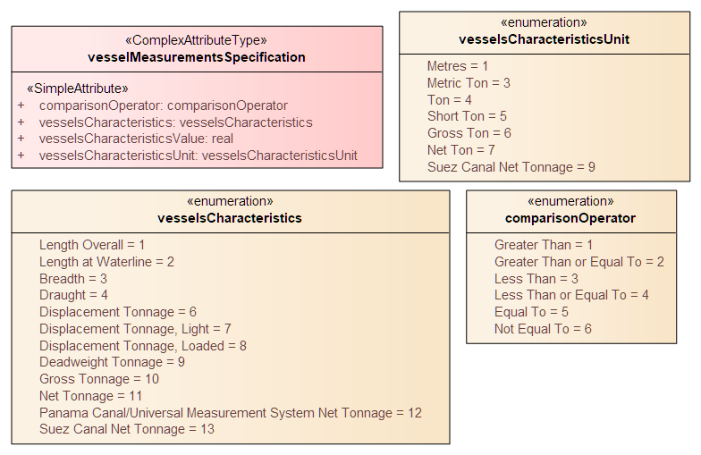

<<<
[[sec_limitations]]
[type=clause]
== Limitations

[[sec_limitations_1]]
=== Introduction

Certain regulations, recommendations, etc., apply only to vessels of specified dimensions, types, or 
carrying specified cargo, etc. Similarly, certain features have specific significance for vessels of 
specified dimensions (e.g., different speed limits for vessels carrying specified cargoes or exceeding 
specified dimensions, or entry prohibitions for certain vessel types).

[[sec_limitations_2]]
=== Defining subsets of vessels by dimensions, cargo, and other characteristics

This is modelled by first defining the relevant subset of vessels according to the dimension, type, cargo, 
etc., and then associating that subset to the appropriate feature or information type. The subset of 
vessels is modelled using the *Applicability* class, which contains attributes for the most common vessel 
characteristics used in nautical publications. These include measurements (length, beam, draught), 
type of cargo, displacement, etc. Constraints which cannot be modelled using the attributes of 
*Applicability* can be described in plain text in its information attribute.

[[fig_vessel_characteristics]]
.Characteristics and dimensions defining sets of vessels
image::Applic&#32;attribs.png[]

Conditions relating to vessel dimensions are modelled by the complex attribute _vesselMeasurementsSpecification_, 
which has sub-attributes for naming the dimension and indicating the limit (whether the condition applies 
to a vessel which exceeds or falls below the limit). 

[[fig_vessel_dimensions]]
.Attributes for specifying vessel dimensions

For example, the combinations in <<table_conditions_example>> below describe the conditions “length overall &gt; 50 m” (Condition 1); “length overall &lt; 90 m” (Condition 2); and “breadth &gt; 20 m” (Condition 3).

[[table_conditions_example]]
[cols="a,a,a,a",options="headers"]
.Examples of conditions based on vessel dimensions
|===
h|Attribute	h|Condition 1	h|Condition 2	h|Condition 3

|vesselsCharacteristics	|length overall	|length overall	|breadth
|comparisonOperator	|greater than	|less than	|greater than
|vesselsCharacteristicsValue	|50	|90	|20
|vesselsCharacteristicsUnit	|metre	|metre	|metre
|===

The _logicalConnectives_ attribute of *Applicability* is used to indicate how multiple conditions are combined. Combinations may be cumulative (conjunctive, AND) or alternatives (disjunctive, OR).

EXAMPLE 1: Encoding _logicalConnectives=AND_ combined with Conditions 1 and 2 above describes a vessel of length between 50 and 90 metres.

EXAMPLE 2: Encoding _logicalConnectives=OR_ combined with Conditions 1 and 3 describes a vessel of length greater than 50 metres or beam greater than 20 metres.

This modelling cannot represent subsets defined by both AND and OR combinations, but it is always possible to convert such complex conditions into multiple combinations each using only AND (‘conjunctive normal form’) or OR (‘disjunctive normal form’), and model the subset using more than one *Applicability* object.

[[sec_limitations_3]]
=== Characterizing the relationship between the vessel set and the feature or regulation

The relationship between a set of vessels and a geographic feature may be one of several different mandate levels ranging from prohibition on use of entry
into a geographic location to mandatory use of a feature (such as vessels exceeding certain dimensions being required to board pilots at an outer boarding place).

The relationship between a set of vessels and a regulation information type (or recommendation, restriction, or special note) may be one of inclusion or
specific exclusion - either the regulation (recommendation, etc.) specifically applies to the specified set of vessels, or the specified set of vessels
is explicitly excluded from the regulation. (If a regulation does not apply to a set of vessels but there is no explicit exemption stated in the source
material, there is no relationship that needs to be encoded.) 

The association classes *PermissionType* and *InclusionType* (Figures <<fig_permission,droploc%>> and <<fig_inclusion_exclusion,droploc%>>) characterize these relationships using values of their attributes
_categoryOfRelationship_ and _membership_ respectively.

[[fig_permission]]
.Permission relationship
image::../images/Permission&#32;Relationship.png[]

[[fig_inclusion_exclusion]]
.Inclusion/exclusion relationship
image::../images/Inclusion&#32;Relationship.png[]

EXAMPLE 1: A specified set of vessels is COVERED by a regulation and another set of vessels is EXEMPT from the regulation - described by the membership attribute values “included” and “excluded” respectively.

EXAMPLE 2: Vessels with specified cargo and dimensions MUST use a specified berth, vessels of smaller dimensions are RECOMMENDED to use the berth, and naval transports are EXEMPT from using the berth - described by the categoryOfRelationship attribute values “required”, “recommended” and “recommended” respectively.

[[sec_limitations_4]]
===	Production hints and recommended practices (informative)

====	Capturing the application of a regulation, recommendation, etc. to specified kinds of vessels

Encoders may find it easiest to capture the application of a regulation (recommendation , etc.) to a class or set of vessels in three phases:

. Encode the operative part of the regulation (the part that describes what the vessels subject to the regulation must or must not do), creating an instance of *Regulations* (or *Recommendations*, etc., as appropriate). Descriptions of what kinds of vessels are subject to the regulation must be excluded from the content of the *Regulations* instance.
. Create an *Applicability* information type and encode the description of what kinds of vessels are subject to (or exempted from) the regulation.
. Link the two using an *InclusionType* with _membership=included_ if the vessels described by *Applicability* are subject to the regulation, or _membership=excluded_ if they are explicitly exempted from the regulation.

It is not necessary to create separate instances of the regulation for inclusion and exclusion.

====	Capturing the permissibility or otherwise of a geographic feature for specified kinds of vessels

Encoders may find it easiest to capture the permissibility of a feature to specified kinds of vessels in three phases.

. Create the geographic feature if it does not already exist.
. Create an *Applicability* information type and encode the description of what kinds of vessels are required to use the geographic feature.
. Link the two using a *PemissionType* with _categoryOfRelationship = required_.

For the other relationships (prohibited, not recommended, etc.) steps 2 and 3 should be modified accordingly (i.e., if use by certain kinds of vessels is “not recommended” encode the description of that kind of vessels in an *Applicability* and create a linking *PermissionType* with _categoryOfRelationship = not recommended_).

It is not necessary to create a separate instance of the geographic feature for each type of relationship.

====	Constructing the Applicability information type

Where the source material describes complex conditions, encoders may find it useful to write out the conditions in structured language with grouping parentheses, for example, as “(condition A) AND (condition B) AND (condition C)”, or draw diagrams, before encoding *Applicability* and its associations. 

Note that the model limitation on mixing logical connectives means some forms of conditions which use “nesting” cannot be encoded in a single *Applicability* instance and multiple instances must be created.

EXAMPLE&#58; The complex condition “(condition A) AND ((condition B) OR (condition C))” must be encoded as two *Applicability* instances, one with “(condition A) AND (condition B)” and the other with “(condition A) AND (condition C)”.

[[table_conversion_condition]]
[cols="a,a",headers]
.Example of conversion of complex condition to multiple simple conditions
|===
h| Complex condition	h| Encode as

|(condition A) +
AND +
((condition B) OR (condition C))
| Applicability 1: (condition A) AND (condition B) +
 +
Applicability 2: (condition A) AND (condition C)
|===

Data producers may contact NIPWG with questions about encoding complex conditions.

As a last resort, conditions may be written as phrases in natural language and encoded in the information attribute. It is acceptable for an *Applicability* to have only the _information_ attribute populated.

include::features/Applicability.adoc[]

